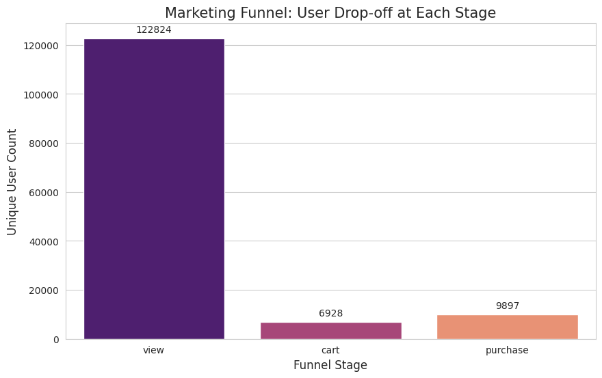
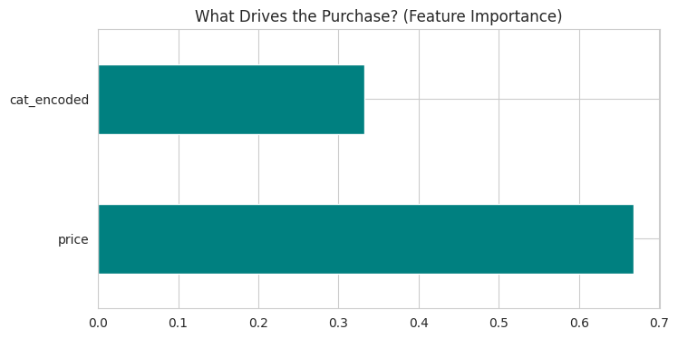

Marketing Funnel & Conversion Performance Analysis

🚀 Data Science & Analytics – Task 3 (2026) | Future Interns

📌 Project Overview
In this project, I analyzed a large-scale e-commerce dataset to understand the customer journey from the initial product view to the final purchase. By identifying drop-off points in the marketing funnel, I developed data-driven recommendations and built a machine learning model to predict user conversion.

This analysis is critical for businesses looking to optimize their digital storefronts and increase revenue through improved conversion rates.

📊 Key Objectives
Funnel Visualization: Map the user journey (View → Cart → Purchase).

Conversion Metrics: Calculate Key Performance Indicators (KPIs) like View-to-Cart and Cart-to-Purchase rates.

Drop-off Analysis: Identify the specific stages where the highest percentage of users leave the platform.

Predictive Modeling: Use a Random Forest Classifier to predict the likelihood of a purchase based on price and product category.

🛠️ Tools & Technologies
Language: Python 3.x

Environment: Google Colab

Libraries:

Pandas: Data manipulation and cleaning.

Seaborn & Matplotlib: Funnel and feature importance visualization.

Scikit-Learn: Machine learning (Random Forest, Label Encoding, Train-Test Split).

OpenDatasets: Efficient Kaggle data integration.

📈 Dataset
Source: E-Commerce Behavior Data from Multi-Category Store (Kaggle)

Scope: The analysis was performed on a sample of 1,000,000 records from the 2019-Oct dataset to ensure efficient processing while maintaining statistical significance.

📊 Visualizations
1. Marketing Funnel Analysis
The Seaborn bar plot below displays the total volume of unique users navigating through each core stage of the e-commerce store. The significant drop-off between the View and Cart stages highlights a key area for user engagement optimization.

2. Predictive Modeling: Feature Importance
After handling the cart abandonment problem with a Random Forest Classifier, the chart below demonstrates which features heavily influenced whether a customer finalized their purchase. product price and category classification proved to be the most influential drivers of user conversion.

🧪 Methodology
Data Cleaning: Removed sessions with missing category data and handled large-scale file reading using chunking.

Exploratory Data Analysis (EDA): Analyzed user behavior patterns across different brands and categories.

Funnel Construction: Grouped unique users by event_type to calculate the conversion "leakage" at each stage.

Modeling: Trained a classifier to identify high-intent shoppers, achieving an evaluation of model accuracy and feature importance.

💡 Business Insights & Recommendations
Insight: The analysis revealed a significant drop-off at the View-to-Cart stage, indicating that while traffic volume is high, initial product interaction or landing page engagement needs refinement.

Recommendation: Implement targeted email remarketing or "Exit-Intent" pop-ups for users identified by the model as "High-Intent" who have added items to their cart but not yet completed their purchase.

Optimization: Streamline the checkout interface and clarify pricing/shipping structures early in the funnel to minimize cart abandonment.

👨‍💻 Author
Sbusiso Gift Mtimunye

BSc in Information Technology Student | Aspiring Data Scientist

LinkedIn Profile: https://www.linkedin.com/in/sbusiso-mtimunye-5a5451254?utm_source=share_via&utm_content=profile&utm_medium=member_android
